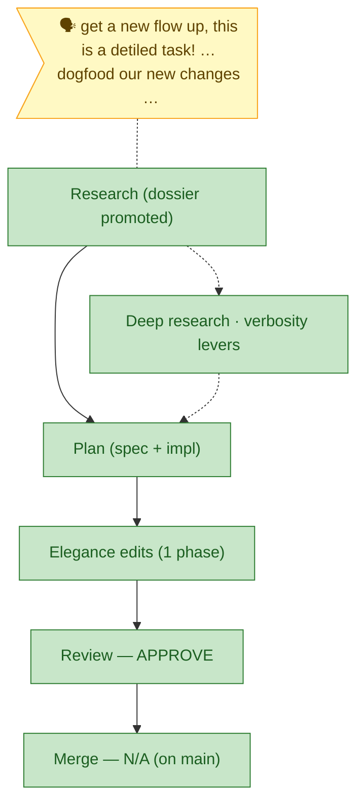

<!-- GENERATED FROM the-flow.json — do not hand-edit; regenerated each guided turn. -->
# Flight plan — flow-elegance-layer

**Legend**: 🟩 done · 🟧 in progress · 🟥 blocked · 🟦 known (designed) · ⬜ assumed (speculative) · 🗣 your words.

**Now**: ✅ **Flow complete.** Implemented (6 files, 67+/3−), validate-v2 **VALIDATED**, review **APPROVE**, F001 + F003 closed, redeployed from source (live in `~/.agents/skills/the-flow`). Merge is **N/A** — work lands directly on `main`, no branch.
**Next**: Outstanding only — **commit/push to `main`** (your call; git read-only until you ask). The deployed store is built from the working tree, so committing is the durable step.

_Harness: router installed, this repo unprovisioned → no harness nodes; standard testing applies._
