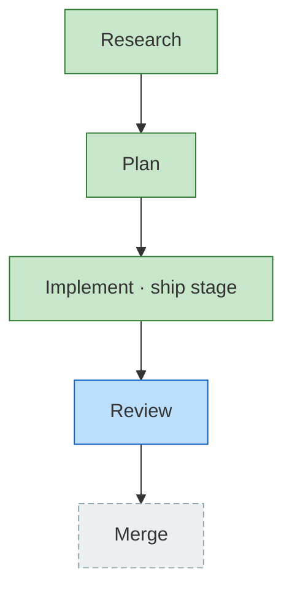

<!-- GENERATED by `harness flow render` — do not hand-edit; regenerate from the flow JSON. -->
# Flow · flow-ship-stage

**Kind**: flight-plan · **Now**: impl · **Next**: review · **Intent**: Ship-stage redesign: replace stage 8 merge with a ship verb (push + open PR + watch CI checks); demote local merge to a conditional 8c reconcile excursion; merge optional; best-effort. · **Nodes**: 5 · **Events**: 17

**Rail**: ◆─◆─[ ◆ ]─◇─◇  ◆ Research · ◆ Plan · [ ◆ Implement · ship stage ] · ◇ Review · ◇ Merge

**Legend**: 🟩 done · 🟧 in-progress · 🟥 blocked · 🟦 known (designed) · ⬜ assumed (speculative) · 🔶 decision · 🗣 user input · 🟪 harness loop · 🤖 companion · 🛠 worker · 🧰 chore (upkeep).
