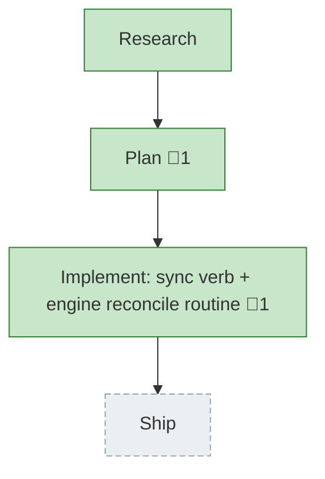

<!-- GENERATED by `harness flow render` — do not hand-edit; regenerate from the flow JSON. -->
# Flow · flow-spine-reconcile

**Kind**: flight-plan · **Now**: phase-1 · **Next**: ship · **Intent**: Add a first-class sync/reconcile maintenance verb to the-flow that auto-reconciles the flight plan (all past/present/future phases + workshops + harness chores) on every entry and is invokable directly. · **Nodes**: 4 · **Events**: 20

**Rail**: ◆─◆─[ ◆ ]─◇  ◆ Research · ◆ Plan · [ ◆ Implement: sync verb + engine reconcile routine ] · ◇ Ship

**Legend**: 🟩 done · 🟧 in-progress · 🟥 blocked · 🟦 known (designed) · ⬜ assumed (speculative) · 🔶 decision · 🗣 user input · 🟪 harness loop · 🤖 companion · 🛠 worker · 🧰 chore (upkeep).

## Node log

### plan · Plan
- `2026-06-27T05:50:20.778Z` · — · decision — Name collision: 'reconcile' is taken (8c). Default to 'sync' for the maintenance verb pending user confirmation.

### phase-1 · Implement: sync verb + engine reconcile routine
- `2026-06-27T05:57:18.441Z` · — · decision — Verb name confirmed: 'sync' (user, 2026-06-27). 'reconcile' rejected — collides with 8c reconcile.
