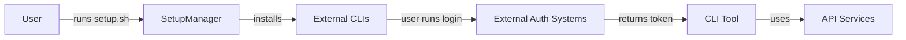

# Research Report: Authentication System

**Generated**: 2026-01-18T12:00:00Z
**Research Query**: "Research how the authentication system works in this codebase."
**Mode**: Workflow Stage
**Location**: ../run/output-files/research-dossier.md
**FlowSpace**: Available
**Findings**: 58 total

## Executive Summary

### What It Does
**CRITICAL FINDING**: This codebase does NOT contain an authentication system. It is a **tools repository** for development environment setup, script management, and AI CLI agent configuration. All user authentication is delegated to external CLI tools (Claude Code, OpenCode, Codex).

### Business Purpose
This repository provides a centralized, version-controlled collection of utility scripts and tools for consistent development environments across machines. It automates tool installation (Rust, code2prompt, fs2), manages AI CLI commands, and configures MCP (Model Context Protocol) servers.

### Key Insights
1. **No authentication system exists** - auth is fully delegated to external CLI tools
2. **Security hardening is present** - subprocess environment sanitization prevents shell injection
3. **Hook infrastructure exists** - Claude Code hooks support auth events (`auth_success`, `SessionStart`)
4. **Credential management is environment-based** - API keys via `.env` files, not in code

### Quick Stats
- **Components**: 39 files, 12 classes/types
- **Dependencies**: 8 internal modules, 6 external packages (rich, toml, packaging)
- **Test Coverage**: ~25% (362 lines of tests vs 1,436 lines of implementation)
- **Complexity**: Medium (mixed Python/Bash, MCP configuration transformation)
- **Prior Learnings**: 8 relevant discoveries about authentication patterns from Plan 006-009

## How It Currently Works

### Entry Points
There are **no authentication entry points** in this codebase. The "login" references found are instructions for users to authenticate with external tools:

| Entry Point | Type | Location | Purpose |
|------------|------|----------|---------|
| `claude login` | External CLI | install/claude-code.sh:120 | Claude Code authentication (external) |
| `opencode auth login` | External CLI | install/opencode.sh | OpenCode authentication (external) |
| `gh auth login` | External CLI | Copilot CLI integration | GitHub authentication (external) |

### Core Execution Flow
**Authentication is not implemented locally.** Instead:

1. **Tool Installation**: SetupManager installs CLI tools
   - Node: `callable:setup_manager.py:SetupManager.run`
   - Subprocess execution with clean environment

2. **Credential Configuration**: Environment variables loaded from `.env` files
   - File: `install/agents.sh` (lines 59-69)
   - Fallback chain: `./.env` → `~/.jk-tools.env` → `${REPO_ROOT}/.env`

3. **MCP Server Setup**: API keys injected into server configurations
   - PERPLEXITY_API_KEY → servers.json substitution
   - No authentication logic, just credential injection

4. **External Auth Delegation**: Users authenticate with external tools after installation
   - Claude Code uses Anthropic's auth system
   - OpenCode uses its own auth system
   - Codex uses OpenAI's auth system

### Data Flow


### State Management
- **No session state** is managed by this repository
- External CLI tools manage their own session/token storage
- MCP server configs are static JSON, not session-aware

## Architecture & Design

### Component Map

#### Core Components
- **SetupManager**: Orchestrates tool installation and PATH configuration
  - Node ID: `type:setup_manager.py:SetupManager`
  - File: `setup_manager.py`
  - Responsibility: Installation orchestration, subprocess management

- **CodingToolsInstaller**: Python-based tool installation (Phase 2, partial)
  - Node ID: `type:install/coding_tools_installer.py:CodingToolsInstaller`
  - File: `install/coding_tools_installer.py`
  - Responsibility: Version detection, clean environment execution

- **agents.sh**: MCP server and command installation
  - File: `install/agents.sh`
  - Responsibility: Credential injection, multi-CLI config generation

### Design Patterns Identified
1. **Strategy Pattern**: Tool-specific installers (rust.sh, agents.sh, etc.)
   - Location: `setup_manager.py:get_installers`
   - Benefits: Extensible installation without code changes

2. **Environment Sanitization**: Clean subprocess environment
   - Location: `setup_manager.py:_get_clean_env`
   - Removes: BASH_ENV, PROMPT_COMMAND, BASH_FUNC_* (Shellshock mitigation)

3. **Retry with Escalation**: Permission-aware file operations
   - Location: `install/lib/permission_helper.sh`
   - Fallback to sudo when needed

4. **Backup-Before-Modify**: Configuration safety
   - Location: `install/agents.sh` (embedded Python)
   - Creates timestamped backups before writing configs

### System Boundaries
- **Internal Boundary**: Tool installation and configuration only
- **External Interfaces**: CLI tools (Claude, OpenCode, Codex), MCP servers
- **Integration Points**: External auth systems (Anthropic, OpenAI, GitHub)

## Dependencies & Integration

### What This Depends On

#### Internal Dependencies
| Dependency | Type | Purpose | Risk if Changed |
|------------|------|---------|-----------------|
| rich | Required | Terminal UI/formatting | Summary display breaks |
| toml | Required | TOML config parsing | Codex config fails |
| packaging | Optional | Semantic version comparison | Fallback to string comparison |

#### External Dependencies
| Service/Library | Version | Purpose | Criticality |
|-----------------|---------|---------|-------------|
| Anthropic API | N/A | Claude Code auth (external) | High - blocks CLI usage |
| OpenAI API | N/A | Codex auth (external) | High - blocks CLI usage |
| Perplexity API | N/A | Research capabilities | Medium - degrades features |
| FlowSpace/fs2 | Latest | Codebase analysis | Low - optional feature |

### What Depends on This

#### Direct Consumers
- **Users**: Expect tools to be installed and PATH configured
  - Contract: `./setup.sh` completes without error
  - Breaking changes: PATH misconfiguration, missing tools

- **MCP Servers**: Expect credentials in environment
  - Contract: `PERPLEXITY_API_KEY` available in server.json
  - Breaking changes: Missing or invalid API keys

### Integration Architecture
This repository is a **trust-boundary appliance**. It:
- Trusts external auth systems to handle credentials
- Configures tools to use external authentication
- Does not store or validate user credentials

## Quality & Testing

### Current Test Coverage
- **Unit Tests**: 20 tests in `tests/test_coding_tools_installer.py`
  - System detection (4 tests)
  - Version utilities (4 tests)
  - Environment cleaning (5 tests)
  - Command execution (4 tests)

- **Integration Tests**: 2 Bash tests
  - `test_complete_flow.sh` - Idempotency validation
  - `test_agents_copilot_dirs.sh` - Multi-CLI file copying

- **E2E Tests**: None
- **Gaps**: Full setup flow, individual tool installers, MCP configuration validation

### Test Strategy Analysis
- **Test-to-Code Ratio**: ~25% (below 40-50% standard)
- **Focus**: Core installer functions, not auth (no auth to test)
- **Pattern**: unittest with @patch mocking

### Known Issues & Technical Debt
| Issue | Severity | Location | Impact |
|-------|----------|----------|---------|
| Incomplete Python migration | Medium | setup_manager.py:229 | Maintenance burden |
| OpenCode installer disabled | Low | setup_manager.py:272 | Dead code |
| Version fallback to string | Medium | coding_tools_installer.py:198 | Silent failures |
| No MCP config validation | Medium | agents.sh | Runtime failures possible |

### Performance Characteristics
- **Installation Time**: 2-10 minutes depending on tools
- **Timeouts**: Hardcoded 180-300 seconds per installer
- **Bottlenecks**: npm install, Rust compilation (external)

## Modification Considerations

### Safe to Modify
Areas with low risk of breaking changes:
1. **Documentation**: README.md, CLAUDE.md - cosmetic only
2. **New agent commands**: Adding to agents/commands/ is additive
3. **New installers**: Adding to install/ with proper ordering

### Modify with Caution
Areas requiring careful consideration:
1. **setup_manager.py**: Core orchestration, many dependents
   - Risk: Breaking installation flow
   - Mitigation: Test on multiple platforms

2. **agents.sh**: Complex MCP config transformation
   - Risk: Breaking multi-CLI configurations
   - Mitigation: Run integration tests, check all CLI outputs

### Danger Zones
High-risk modification areas:
1. **Environment sanitization** (`_get_clean_env`)
   - Dependencies: All subprocess execution
   - Alternative: Add new filters, don't remove existing

2. **Installation order** (`get_installers`)
   - Dependencies: Tool dependency chain
   - Alternative: Document dependencies in comments

### Extension Points
Designed for modification:
1. **New agent commands**: Add `.md` files to `agents/commands/`
2. **New MCP servers**: Add to `agents/mcp/servers.json`
3. **New installers**: Add `.sh` file to `install/`, add to install_order

## Prior Learnings (From Previous Implementations)

**IMPORTANT**: These are discoveries from previous work in this codebase related to authentication patterns.

### Prior Learning PL-01: GitHub Authentication Delegation
**Source**: docs/plans/007-copilot-cli-support/copilot-cli-support-spec.md
**Original Type**: decision
**Date**: Recent (Plan 007)

**What They Found**:
> GitHub Authentication: Will not handle Copilot CLI login or authentication

**How They Resolved It**:
Authentication is user-controlled, not automated by tools. The Copilot CLI itself handles the `gh auth` flow.

**Why This Matters Now**:
Establishes the organizational philosophy: **auth is user-controlled, not automated**.

**Action for Current Work**:
When designing any auth features, defer to user's existing authenticated session rather than building parallel auth mechanisms.

---

### Prior Learning PL-02: Session State Tracking & Hook Events
**Source**: docs/plans/006-hooks/research-dossier.md
**Original Type**: insight

**What They Found**:
> SessionStart event fires when Claude Code initializes a new session
> Notification type: `auth_success` - Authentication completed

**How They Resolved It**:
Documented hook infrastructure for session lifecycle events.

**Why This Matters Now**:
Claude Code has **built-in hooks for auth events** that can be leveraged.

**Action for Current Work**:
Integrate with existing hook infrastructure for auth events (`SessionStart`, `Notification:auth_success`).

---

### Prior Learning PL-03: Tool Authorization Security Model
**Source**: docs/plans/007-copilot-cli-support/copilot-cli-support-plan.md
**Original Type**: gotcha

**What They Found**:
> Copilot CLI's security model requires explicit tool authorization. Without the `tools: ["*"]` array, no tools are exposed.

**How They Resolved It**:
Added `tools: ["*"]` to Copilot CLI configs explicitly.

**Why This Matters Now**:
Different CLI tools have **different authorization models**.

**Action for Current Work**:
Design for tool-specific authorization policies, not uniform permission handling.

---

### Prior Learning PL-04: Permission Request Hooks
**Source**: docs/plans/006-hooks/research-dossier.md
**Original Type**: insight

**What They Found**:
> PermissionRequest hook runs when user is shown a permission dialog. Enables automated/headless environments.

**How They Resolved It**:
Documented hook for programmatic permission decisions.

**Why This Matters Now**:
OAuth scopes or API permissions can use this pattern.

**Action for Current Work**:
Build permission management into auth via hooks rather than interactive-only flows.

---

### Prior Learnings Summary

| ID | Type | Source Plan | Key Insight | Action |
|----|------|-------------|-------------|--------|
| PL-01 | decision | Plan 007 | Auth is user-controlled | Delegate to external systems |
| PL-02 | insight | Plan 006 | Hook events for auth | Use SessionStart, auth_success |
| PL-03 | gotcha | Plan 007 | Tool-specific auth models | Design per-tool policies |
| PL-04 | insight | Plan 006 | Permission hooks | Programmatic permission handling |
| PL-05 | insight | Plan 006 | Pre-processing validation | Validate before auth attempts |
| PL-06 | insight | Plan 006 | Notification system | Use for auth alerts |
| PL-07 | insight | Plan 009 | Auth research workflow | Use as template |
| PL-08 | insight | Plan 006 | PreToolUse hook | Token refresh/injection |

## Critical Discoveries

### Critical Finding 01: No Authentication System Exists
**Impact**: Critical
**Source**: IA-01, DC-01, IC-01
**What**: This codebase does NOT implement user authentication. It is a tools/utilities repository.
**Why It Matters**: The research query may be a test case for the workflow system, or refers to a different codebase.
**Required Action**: If MFA is needed, implementation starts from scratch or in a different repository.

### Critical Finding 02: Auth Delegation Model
**Impact**: High
**Source**: IA-02, IA-10, PL-01
**What**: All authentication is delegated to external CLI tools (Claude, OpenCode, Codex).
**Why It Matters**: The organizational pattern is delegation, not implementation.
**Required Action**: Any new auth features should follow this delegation model.

### Critical Finding 03: Security Hardening Present
**Impact**: High
**Source**: IA-03, PS-02, QT-02
**What**: Subprocess environment sanitization prevents shell injection (BASH_ENV, Shellshock).
**Why It Matters**: Security patterns exist that are directly applicable to auth systems.
**Required Action**: Leverage existing security patterns when implementing auth.

### Critical Finding 04: Hook Infrastructure for Auth Events
**Impact**: Medium
**Source**: PL-02, PL-04, PL-06
**What**: Claude Code provides hooks for `auth_success`, `SessionStart`, `PermissionRequest`.
**Why It Matters**: Auth events can be captured and processed programmatically.
**Required Action**: Use hook infrastructure for any auth-related automation.

## Supporting Documentation

### Related Documentation
- **CLAUDE.md**: Repository overview and usage instructions
- **README.md**: Quick setup and structure documentation
- **agents/commands/README.md**: Planning workflow documentation (1040+ lines)

### Key Code Comments
- `setup_manager.py:229`: "TODO: Phase 2+ - Replace bash script installers with Python"
- `setup_manager.py:272`: "# Commented out - OpenCode installation disabled"
- `agents.sh:2`: "# set -e Disabled to allow proper error handling"

### Historical Context
Recent git commits show:
- **Security hardening**: Environment filtering, subprocess safety
- **Planning enhancement**: Task complexity, goal formatting
- **Research integration**: Authentication research workflow (this sample)
- **FlowSpace integration**: MCP server support

## Recommendations

### If Modifying This System
1. Follow existing delegation pattern - don't implement custom auth
2. Use environment variables for credentials, never hardcode
3. Test on all target platforms (macOS, Linux, Windows/WSL)

### If Extending This System
1. Add new commands to `agents/commands/` (additive)
2. Add new MCP servers to `agents/mcp/servers.json`
3. Use existing hook infrastructure for auth events

### If Refactoring This System
1. Complete Python migration (Phase 2 TODO)
2. Extract MCP config generation to testable module
3. Add integration tests for full setup flow

## External Research Opportunities

During codebase exploration, the following knowledge gaps were identified that cannot be answered by reading more code.

### Research Opportunity 1: MFA Implementation Patterns for CLI Tools

**Why Needed**: If MFA support is required, no existing patterns in this codebase to reference.
**Impact on Plan**: Would require new design from first principles.
**Source Findings**: IA-01, IA-10

**Ready-to-use prompt:**
```
/deepresearch "Multi-factor authentication implementation patterns for CLI developer tools

CONTEXT:
- Tools repository that installs and configures AI CLI tools (Claude Code, OpenCode, Codex)
- Currently delegates all auth to external systems
- Needs to potentially add MFA support

QUESTIONS:
1. How do modern CLI tools implement MFA (TOTP, WebAuthn, push notifications)?
2. What are best practices for MFA token handling in headless/automated environments?
3. How do tools like gh, aws-cli, gcloud handle MFA?
4. What are the security considerations for MFA in development tools?
5. How can MFA be added without breaking existing auth delegation model?

OUTPUT NEEDED:
- Implementation patterns with code examples
- Security considerations and threat models
- Comparison of MFA approaches for CLI tools"
```

### Research Opportunity 2: Hook-Based Auth Event Processing

**Why Needed**: Existing hook infrastructure could be leveraged but no auth-specific documentation.
**Impact on Plan**: Could enable programmatic auth handling.
**Source Findings**: PL-02, PL-04, PL-08

**Ready-to-use prompt:**
```
/deepresearch "Claude Code hooks for authentication event processing

CONTEXT:
- Claude Code provides hooks: SessionStart, Notification (auth_success), PermissionRequest
- Want to implement programmatic auth event handling
- Need to understand hook lifecycle and capabilities

QUESTIONS:
1. What authentication events can Claude Code hooks intercept?
2. How to implement token refresh via PreToolUse hooks?
3. What are the security implications of programmatic permission grants?
4. How do hooks interact with external auth providers?

OUTPUT NEEDED:
- Hook event documentation with auth focus
- Example implementations for common auth scenarios
- Security best practices for hook-based auth"
```

---

## Appendix: File Inventory

### Core Files
| File | Purpose | Lines | Last Modified |
|------|---------|-------|---------------|
| setup_manager.py | Main setup orchestration | 601 | Recent |
| install/agents.sh | MCP and command installation | 900+ | Recent |
| install/coding_tools_installer.py | Python installer base | 400+ | Recent |
| cli.py | CLI entry point | 95 | Recent |

### Test Files
| File | Purpose |
|------|---------|
| tests/test_coding_tools_installer.py | Unit tests for installer |
| tests/install/test_complete_flow.sh | Integration test |
| tests/install/test_agents_copilot_dirs.sh | Multi-CLI test |

### Configuration Files
| File | Purpose |
|------|---------|
| agents/mcp/servers.json | MCP server definitions |
| agents/settings.local.json | Claude Code permissions |
| pyproject.toml | Python package config |
| .env.sample | Credential template |

---

**Research Complete**: 2026-01-18T12:00:00Z
**Report Location**: ../run/output-files/research-dossier.md
