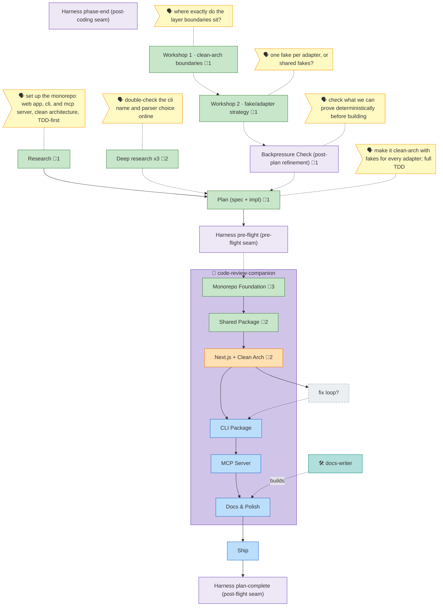

<!-- GENERATED by `harness flow render` — do not hand-edit; regenerate from the flow JSON. -->
# Flow · project-setup

**Kind**: flight-plan · **Now**: p3 · **Next**: p4 · **Nodes**: 17 · **Events**: 0

**Rail**: ◆─◆─[ ◆─◆─◐─◇─◇─◇─◇ ]  ◆ Research · ◆ Plan (spec + impl) · [ ◆ Monorepo Foundation · ◆ Shared Package · ◐ Next.js + Clean Arch · ◇ CLI Package · ◇ MCP Server · ◇ Docs & Polish · ◇ Ship ]

**Legend**: 🟩 done · 🟧 in-progress · 🟥 blocked · 🟦 known (designed) · ⬜ assumed (speculative) · 🔶 decision · 🗣 user input · 🟪 harness loop · 🤖 companion · 🛠 worker · 🧰 chore (upkeep).

## Node log

### research · Research
- 📄 artifacts: research-dossier.md

### dr · Deep research x3
- 📄 artifacts: external-research/cli-naming.md, external-research/parser.md

### ws1 · Workshop 1 · clean-arch boundaries
- 📄 artifacts: workshops/001-clean-arch.md

### ws2 · Workshop 2 · fake/adapter strategy
- 📄 artifacts: workshops/002-fakes.md

### bp · Backpressure Check (post-plan refinement)
- 📄 artifacts: backpressure-coverage.md

### plan · Plan (spec + impl)
- 📄 artifacts: project-setup-plan.md

### p1 · Monorepo Foundation
- 📄 artifacts: tasks/phase-1-monorepo-foundation/tasks.md, tasks/phase-1-monorepo-foundation/execution.log.md, reviews/review.phase-1-monorepo-foundation.md

### p2 · Shared Package
- 📄 artifacts: tasks/phase-2-shared-package/tasks.md, reviews/review.phase-2-shared-package.md

### p3 · Next.js + Clean Arch
- 📄 artifacts: tasks/phase-3-nextjs-app/tasks.md, tasks/phase-3-nextjs-app/execution.log.md
