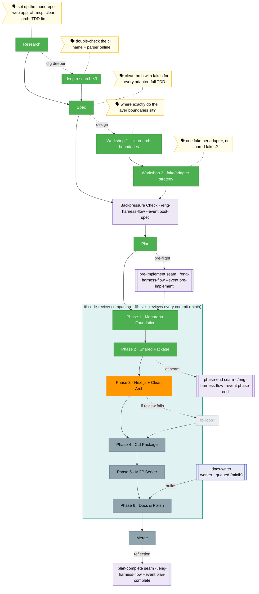

# `the-flow.md` template (flight view)

> **Worked-example template** — copy this shape. It is **generated from [`flight-plan.template.json`](./flight-plan.template.json)** (the source of truth); never hand-edit the rendered `the-flow.md` as the primary. Snapshot: a 6-phase Full plan, Phases 1–2 done, **Phase 3 in progress**. Every workshop is its **own node**; each stage where the user typed shows a **verbatim 🗣 speech bubble**; the `code-review-companion` **wraps** the build phases (subgraph); a `docs-writer` **worker** is a side-node; the **harness seams** appear as first-class violet nodes whose commands are router invocations (`/eng-harness-flow --event …`) — they vanish entirely when the router isn't installed.

**Plan**: project-setup · **Mode**: Full · **Phases**: 6
**Rail**: `[the-flow] ◆─◆─◆─[◆─◆─◇─◇─◇─◇]─◇`   ·   **now**: Phase 3 (Next.js) · **next**: Phase 4 (CLI) · **phase 3/6**
> _The `now · next` segment after the diamonds renders in a distinct accent colour in the live terminal._

**Legend**: 🟩 done · 🟧 in progress · 🟥 blocked · 🟦 known future (designed) · ⬜╴assumed future (dashed) · 🟨 🗣 verbatim user input · companion (teal, wraps) · worker (indigo, side) · 🟪 harness seams (violet — routed via `/eng-harness-flow`)

_Generated from `the-flow.json`. Each spine/excursion node links its artifacts and carries a note (what & why); nodes the user spoke at hang a yellow bubble with their **exact words**. Workshops are shown individually (W1, W2) — never collapsed. The **harness seams are first-class**, and every one routes through the single external entry point `/eng-harness-flow` (child skills are private and never named): the post-spec seam (Backpressure Check) sits on the spine between Spec and Plan; pre-implement pre-flights each phase; phase-end fires at seams; plan-complete fires at merge. **All harness nodes are omitted entirely when the router isn't installed** (probe `~/.agents/skills/eng-harness-flow/SKILL.md`, fallback `~/.claude/skills/`) — a repo without a harness simply shows the spine + workshops. Before `/plan-3`, P4–P6 + Merge were `assumed`; locking the plan flipped them `known`. If Phase 3's review fails, `fix loop?` flips `assumed → in_progress`._
