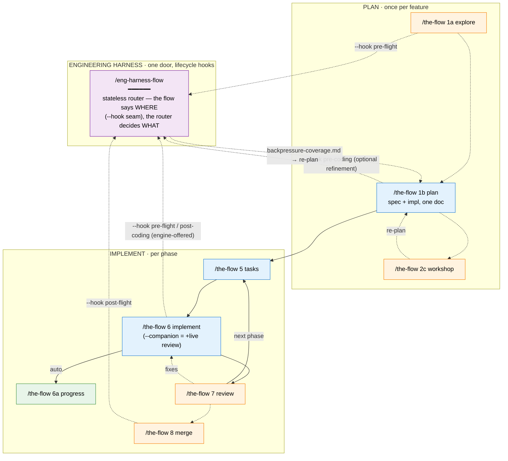
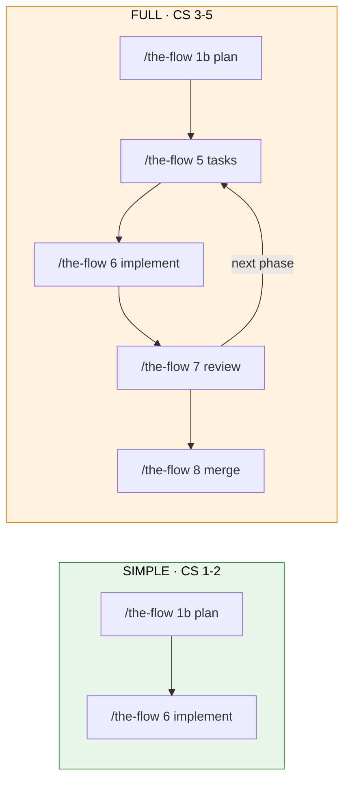

<!-- 🔄 RENDERED from SKILL.md § Registry + references/00-routing.md § Graph — regenerate against those masters, never hand-edit as the primary. -->
# The SDD Pipeline (`/the-flow`) + the Engineering Harness — Getting Started

A visual guide to the **spec-driven-development** pipeline — shipped as one progressive-disclosure skill, **`the-flow`** — and the **engineering harness** that runs side by side with it. The entry point is almost always bare `/the-flow` (guided mode), or a direct jump like `/the-flow 1a explore` (research) / `/the-flow 1b plan` (the planning document — business spec + implementation plan). Everything else chains from there.

> Repo reference: the SDD pipeline lives at `skills/SDD/the-flow/` in `jakkaj/tools` — one public skill built to the flow-architecture pattern (`docs/skills-pipeline/flow-architecture.md`), with per-stage **sub-skills** under `references/stages/`. The harness skills live in the **external** `AI-Substrate/harness-engineering` repository and are reached through exactly one door: the **`/eng-harness-flow`** router. Full command reference: `docs/skills-pipeline/README.md`. Switchover history: `docs/plans/029-eng-harness-switchover/`.

---

## One public skill, progressive disclosure

The pipeline used to be a family of standalone per-stage skills; it is now **one skill** composed of lazily-loaded **sub-skills** (contract-bound verbs that know nothing about the flow — the dispatch's Registry assigns their ids, and the Graph in `references/00-routing.md` owns every edge). Same pipeline, same stages, same order, same optional branches — only the surface changed. The public grammar is:

```
/the-flow                       # guided mode — the co-pilot drives
/the-flow <id|verb> [flags]     # direct jump — run exactly one stage
```

- **Guided mode** — bare `/the-flow` loads `references/coach.md` + `references/00-routing.md` + the *current* stage's sub-skill only, then drives you conversationally. The rest of the pipeline stays out of context until you reach it.
- **Direct jump** — `/the-flow 6 implement --phase … --plan …` loads exactly **one** sub-skill and runs that stage. Ids and verbs each resolve alone when typed (`6` ≡ `implement`); printed commands always carry both.
- **Back-compat** — old per-stage slugs found in pre-consolidation state files (and typed `6c`/`companion`) are translated by the dispatch's translation/alias table; you never type them.

| Stage | Id | Verb | Sub-skill loaded |
|---|---|---|---|
| Explore (research) | `1a` | `explore` | `references/stages/10-explore.md` |
| Plan (spec + impl) | `1b` | `plan` | `references/stages/20-plan.md` — writes the business spec **and** the implementation plan into one document, always both; mid-plan clarify re-entry lives inside, as a Re-entry section |
| Workshop | `2c` | `workshop` | `references/stages/25-workshop.md` |
| ADR | `3a` | `adr` | `references/stages/35-adr.md` |
| Phase tasks | `5` | `tasks` | `references/stages/50-phase-tasks.md` |
| Implement | `6` | `implement` | `references/stages/60-implement.md` — `--companion` mode adds a live minih reviewer |
| Progress | `6a` | `progress` | `references/stages/62-progress.md` |
| Review | `7` | `review` | `references/stages/70-review.md` |
| Merge | `8` | `merge` | `references/stages/80-merge.md` |

> **What changed (formerly)**: each stage was its own public skill — `/plan-1a`; `/plan-1b` (specify) **and** `/plan-3` (architect), now folded into the single `1b plan` step that writes the business spec and implementation plan into one document in one atomic pass; `/plan-2` (clarify — now the Re-entry section of stage 1b); `/plan-2c`, `/plan-3a`, `/plan-5`, `/plan-6` (+ its companion variant, now the implement verb's `--companion` mode), `/plan-6a`, `/plan-7`, `/plan-8`. Those skills are deleted; `/the-flow <id|verb> [flags]` is the only public surface for the main flow (typed `6c` or `companion` still resolves, via the alias table, to implement with `--companion`; typed `specify` or `architect` resolve to `1b plan`). The utility skills (`validate-v2`, `flowspace-research-v2`, `deepresearch-v2`, `didyouknow-v2`, `htmlify-v2`, `plan-0-v2-constitution`, `plan-2b-v2-prep-issue`, `plan-v2-extract-domain`, `util-0-v2-handover`, `install-hve-core-rpiv`) are unchanged and still called by their own names.

---

## The Big Picture

Two loops run side by side in the same context — that is all. Neither owns the other:

- **SDD pipeline** (you drive it) — `/the-flow 1a explore → 1b → [2c] → 5 → 6 → 7 → 8`, one stage per call (by id or by name). A linear journey: plan (spec + impl, one document) → tasks → code → review → merge, with the optional post-spec backpressure check as a post-plan refinement off 1b.
- **Engineering harness** (the external eng-harness family drives it) — a *cycle*: Boot → Backpressure → Observe → Retro → Improve. The flow's stages never run harness stages themselves; the guided **engine** offers each seam at the Graph edge (seams are **flow-owned** — `references/harness-seams.md`; the stage sub-skills are harness-blind) and tells the router *where the work is* via a lifecycle **hook**:

| Seam (Graph edge) | Offered by | Router call (`--event` alias) |
|---|---|---|
| flow entry | the engine, at flow entry | `/eng-harness-flow --hook pre-flight` (`session-start`) |
| post-plan refinement off 1b | the engine, as a Graph-edge beat | `/eng-harness-flow --hook pre-coding --spec <path>` (`post-spec`) |
| before each phase | the engine, before the phase | `/eng-harness-flow --hook pre-flight --phase <id> --plan-dir <p>` (`pre-implement`) |
| each phase end | the engine, at the phase-end edge | `/eng-harness-flow --hook post-coding --plan-dir <p>` (`phase-end`) |
| at merge | the engine, after the merge executes | `/eng-harness-flow --hook post-flight --plan-dir <p>` (`plan-complete`) |

The flow wires **four fire-hooks** (`pre-flight` at the two edges, `pre-coding`, `post-coding`, `post-flight`) and skips the silent `coding` capture. The router's child skills are **private** — they may move or rename, and no SDD stage (or user doc) ever names them. One name is stable: `/eng-harness-flow` + its `--hook` vocabulary (permanent `--event` alias). Full seam map: `docs/how/the-flow-harness-seams.md`.

> **New to this, or want a guide?** Run bare **`/the-flow`** — guided mode walks you through this whole pipeline: it asks what you want to build, narrates each stage, points out one insight per artifact, surfaces the optional branches + `/compact` seams + the harness seams, prints every command first, and offers to run it for you. Re-entrant — it survives `/compact` and can adopt a plan you started by hand. Already know where you're going? Jump straight in: `/the-flow 6 implement --phase … --plan …`.



**Legend**: 🔵 blue = you call it · 🟢 green = auto-called · 🟠 orange = optional · 🟣 purple = the harness router. Solid = main flow, dashed = optional/automatic.

---

## Detection — what happens when there's no harness

Two layers, one calm warning, never a gate:

**Layer 1 — is the router installed?** At flow entry, SDD probes `test -f ~/.agents/skills/eng-harness-flow/SKILL.md` (fallback `~/.claude/skills/eng-harness-flow/SKILL.md`). On a miss, you see exactly one message:

> ⚠️ No engineering harness detected — the eng-harness skills aren't installed. Continuing without one: standard testing applies, nothing else changes. (To add the harness loop: `npx skills@latest add AI-Substrate/harness-engineering -a claude-code -g -y`.)

…then every harness touchpoint is silently omitted for the rest of the flow. No sentinel files, no re-warnings — opting out is conversational ("don't use the harness" and the agent stops calling it).

**Layer 2 — is the repo provisioned?** Router installed → each seam call returns a `--json` envelope (`decision: route | redirect | noop | ambiguous`). A repo with no harness substrate gets one calm line (*"No engineering harness in this repo — proceeding without one; say 'set up a harness' anytime."*), and later seam calls pass `--prompt-optional=false` so you're never nagged. An installed-but-unprovisioned repo shows that calm line but **no per-phase harness nodes** — per-phase boot/retro nodes light up only once the repo is provisioned. Boot verdicts are narrated **verbatim from the envelope**: `healthy / SLOW / UNHEALTHY / UNAVAILABLE` — only `UNHEALTHY` ever pauses to ask you; `UNAVAILABLE` just means standard testing.

---

## Two paths: Simple vs Full

The mode is chosen in stage 1b (the Workflow Mode question, or `--simple` to pre-set it).



**Simple Mode** — single-phase, inline tasks. `/the-flow 1b plan` (front-loads clarifications, writes spec + plan in one document) → `/the-flow 6 implement`. No `/the-flow 5 tasks` expansion needed.

**Full Mode** — multi-phase. `/the-flow 1b plan`, then a per-phase loop of `/the-flow 5 tasks → /the-flow 6 implement → /the-flow 7 review`, then `/the-flow 8 merge` to merge.

> **Merged stages**: stage `1b plan` produces the **business spec and the implementation plan in one document**, in one atomic pass — front-loaded clarifications up front, the validate gates (G1–G7) run inline, and `/validate-v2` auto-runs at the end. Later mid-plan clarifications re-enter through the Re-entry section inside `references/stages/20-plan.md`. There is no separate specify, clarify, architect, or complete-the-plan stage in the flow.

---

## Example Walkthrough

> **Scenario**: Add a `POST /api/widgets` endpoint to an existing app. Full Mode, with the companion reviewer. Router installed; repo provisioned with a harness.

```
1.  /the-flow 1a explore "how are API endpoints structured here?"
    → The engine offers /eng-harness-flow --hook pre-flight (the router checks
      the harness is alive; one calm line either way).
    → 8 parallel subagents → docs/plans/005-api-widgets/research-dossier.md

2.  /the-flow 1b plan "POST endpoint to create widgets (name, color)"
    → Asks testing/mock/docs/mode questions up front, then writes ONE document:
      api-widgets-plan.md (CS-3, Full) — `## Business Specification` on top,
      `## Implementation Plan` below (inline gates G1–G7 + 2 research subagents;
      2 phases). /validate-v2 auto-runs.
    → Optional post-plan refinement (engine-offered): /eng-harness-flow --hook pre-coding --spec ...
      → backpressure-coverage.md (advisory: what's provable vs eyeballed); re-run plan informed by it.

3.  /the-flow 5 tasks --phase "Phase 1: Route & Validation" --plan ".../api-widgets-plan.md"
    → tasks.md (harness seams are engine-owned — offered at the phase edge, not task rows).

4.  /the-flow 6 implement --companion --phase "Phase 1: ..." --plan "..."
    → SEAM FIRST (engine-offered at the phase edge): /eng-harness-flow --hook pre-flight ... —
      the router proves the system runs before a line of code; verdict narrated
      verbatim (healthy → build).
    → Implements; the progress verb (6a) auto-tracks per task.
    → Companion mode reviews each commit live (supersedes /the-flow 7 review here).
    → End of phase (engine-offered): /eng-harness-flow --hook post-coding ... — the router
      decides what reflection happens (you might see a [s/t/p/e/d/a] prompt).

5.  /the-flow 5 tasks + /the-flow 6 implement --companion for Phase 2 ...

6.  /the-flow 8 merge --plan "..."
    → Merge analysis; on PROCEED the merge executes, then the engine offers
      /eng-harness-flow --hook post-flight for the long-horizon
      reflection. Feature complete 🎉
```

You never named a harness skill — the flow told the router *where the work was* at each seam, and the router did the rest. No router installed? Same walkthrough, minus the seam lines, plus one calm warning at step 1. And every step loaded exactly one stage module — the rest of the pipeline stayed out of context.

---

## Quick Reference

| Command | What it does | Produces | Harness behaviour |
|---|---|---|---|
| `/the-flow` | **Guided mode** — drives this whole pipeline conversationally (loads coach + routing + the current stage module only) | `.the-flow-state.json` + `the-flow.{json,md}` + `original-ask.md` | probes for the router; the engine offers the seams at the Graph edges, only via `/eng-harness-flow` |
| `/the-flow 1a explore` · `explore` | Deep-dive codebase research *(optional)* | `research-dossier.md` | engine offers `--hook pre-flight` at flow entry |
| `/the-flow 1b plan` · `plan` | Business spec + implementation plan in one document (front-loaded clarifications; inline gates G1–G7; validate-v2 auto-runs) | `<slug>-plan.md` | engine offers `--hook pre-coding` backpressure as a post-plan refinement (seams engine-owned, not plan rows) |
| `/the-flow 2c workshop` · `workshop` | Design workshop for complex topics *(optional)* | `workshops/<topic>.md` | — |
| `/eng-harness-flow --hook pre-coding` | Backpressure survey *(optional post-plan refinement)* | `backpressure-coverage.md` | advisory output; informs your re-plan; never blocks |
| `/the-flow 3a adr` · `adr` | Architectural Decision Record *(optional)* | `docs/adr/*.md` | — |
| `/the-flow 5 tasks` · `tasks` | Task table + brief for one phase | `tasks.md` | — (harness seams engine-owned, offered at the phase edge) |
| `/the-flow 6 implement` · `implement` | Implement one phase — add `--companion` for live companion review (typed `6c`/`companion` alias here) | code + `execution.log.md` (+ reviews in companion mode) | engine offers `--hook pre-flight` (before) + `--hook post-coding` (after) |
| `/the-flow 6a progress` · `progress` | Progress tracking *(auto-run by the implement verb)* | updated task tables + execution log | none (progress only) |
| `/the-flow 7 review` · `review` | Code review *(rare in companion flow)* | `reviews/review.md` | none (read-only review) |
| `/the-flow 8 merge` · `merge` | Upstream merge analysis | merge plan | engine offers `--hook post-flight` after the merge |
| `/eng-harness-flow` | **The harness front door** — stateless router; detects where the loop is and routes one step | routing envelope (`--json`) | the only harness skill the flow ever calls |

---

## Directory Structure

```
docs/
└── plans/
    └── 005-api-widgets/
        ├── research-dossier.md        ← /the-flow 1a explore (optional)
        ├── api-widgets-plan.md        ← /the-flow 1b plan (business spec + implementation plan)
        ├── backpressure-coverage.md   ← post-spec seam (optional post-plan refinement)
        ├── execution.log.md           ← /the-flow 6 implement
        ├── workshops/                 ← /the-flow 2c workshop (optional)
        └── tasks/
            └── phase-1/
                ├── tasks.md
                └── execution.log.md
```

The harness's own substrate (governance doc, observe scratch, retro records) lives under `.harness/` in repos that have one — owned and documented by the external family, not by SDD.

---

## Key Concepts

### Complexity Scoring (CS 1–5)

Assigned by stage 1b (`/the-flow 1b plan`). Drives Simple vs Full and how much planning ceremony applies.

| CS | Scope | Typical Phases | Path |
|----|-------|---------------|------|
| 1 | Trivial — config, typo | 1 | Simple |
| 2 | Small — single module | 1–2 | Simple |
| 3 | Medium — multiple modules | 2–3 | Full |
| 4 | Large — cross-cutting | 3–5 | Full |
| 5 | Epic — architectural | 5+ | Full |

### The harness relationship in one sentence

> SDD builds the feature; the harness proves the environment and compounds the friction — they run side by side in the same context, touching only at flow-owned seams (four lifecycle hooks, engine-offered at the Graph edges), all through one stable name: `/eng-harness-flow`.

The harness family's own getting-started guide ships with the router (`~/.claude/skills/eng-harness-flow/references/getting-started.md` once installed). The switchover that externalised it is recorded in `docs/plans/029-eng-harness-switchover/` and `CLAUDE.md` (vocabulary-freeze note, override #2).
