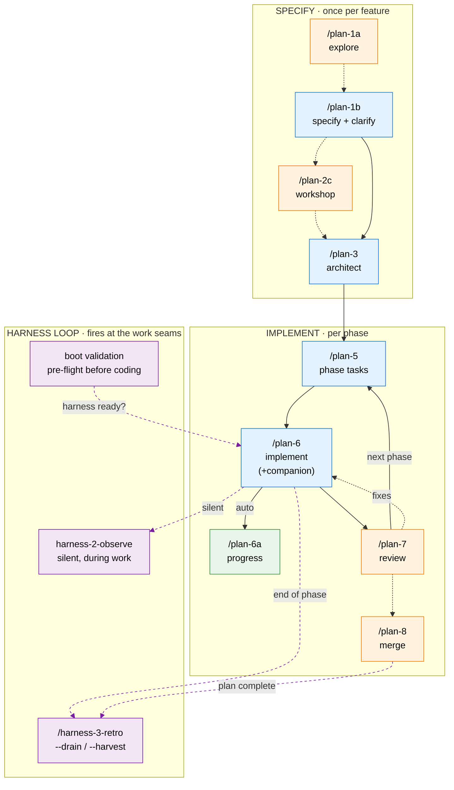
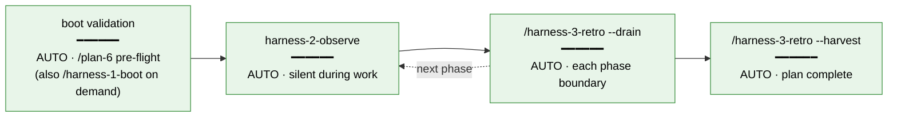
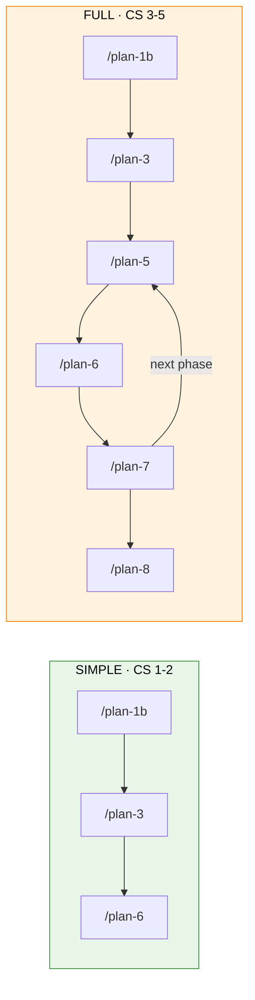

# SDD Pipeline (v3) + Harness Loop — Getting Started

A visual guide to the **spec-driven-development** skills and the **harness loop** that rides alongside them. The entry point is almost always `/plan-1a` (research) or `/plan-1b` (spec). Everything else chains from there.

> Repo reference: the SDD skills live at `skills/SDD/` and the harness loop-stage skills at `skills/harness/` in `jakkaj/tools`. Full command reference: `docs/skills-pipeline/README.md`. Harness consolidation history: `docs/plans/024-harness-nucleus/`.

---

## The Big Picture

Two tracks run at once:

- **SDD pipeline** (you drive it) — `/plan-1a → 1b → [2c] → 3 → 5 → 6 → 7 → 8`, one step per command.
- **Harness loop** (mostly drives itself) — three skills serving the Boot, Observe, and Retro·Magic Wand stages of the full `Boot → Backpressure Check → Do Work and Observe → Retro and Magic Wand → Improve` loop, firing automatically at the seams of the SDD skills.

> **New to this, or want a guide?** Run **`/the-flow`** — a conversational co-pilot that walks you through this whole pipeline: it asks what you want to build, narrates each stage, points out one insight per artifact, surfaces the optional branches + `/compact` seams + harness/backpressure cues, and tells you exactly what to type next. It *drives the `plan-*` flow on this page* — real planning + execution work, not an RPIV/`task-*` teaching loop. It coaches only — it never runs commands for you — and it's re-entrant, so it survives `/compact` and can even pick up a plan you started by hand.



**Legend**: 🔵 blue = you call it · 🟢 green = auto-called · 🟠 orange = optional · 🟣 purple = harness loop. Solid = main flow, dashed = optional/automatic.

---

## How the two tracks fit

The SDD pipeline produces the **artifacts** (spec → plan → tasks → code → review). The harness loop produces **compounding value** — it watches the work happen and turns observed friction into encoded improvements, so the next session is smoother than this one.

You never have to think about the harness loop to use the pipeline. It plugs into the seams automatically. But knowing *where* it fires helps you read its prompts.

```
Boot ──────────────────────────────────────────────────────────────► Retro
  │                          Do Work                                    │
  │  ┌────────────────────────────────────────────────────────────┐    │
  └─►│  /plan-1a  /plan-1b  /plan-3  /plan-5  /plan-6  /plan-7      │◄───┘
     │            (harness-2-observe fires silently throughout)     │
     └────────────────────────────────────────────────────────────┘
```

---

## Where the harness plugs in — and who pulls the trigger

| Harness stage | Skill | Who calls it | When |
|---|---|---|---|
| **Boot** | `/harness-1-boot` (or `/plan-6`'s built-in pre-phase check) | **Auto** before coding; **you** on demand | `/plan-6` and `/plan-6-companion` run a **Boot→Interact→Observe pre-phase validation before the first task** — the readiness gate that confirms the harness is healthy *before any code is written*. The standalone `/harness-1-boot --validate` runs the same check on demand (session start, or `--status` for a quick maturity read). Reports `UNAVAILABLE` (not an error) if the project has no engineering-harness governance doc. |
| **Observe** | `harness-2-observe` | **Auto, silent** | Throughout `/plan-1a`, `/plan-6`, `/plan-7`, `/plan-8`, `/plan-2c` — whenever a skill hits friction (a tool call >30s, a search that should've matched but didn't, a retry, a backtrack, an ambiguous failure). Calibrated to ≤1 self-prompt per 5 min, ≤5 entries/session. You rarely call it yourself. |
| **Retro (drain)** | `/harness-3-retro --drain` | **Auto** at phase boundaries | End of each `/plan-6` phase (and start of a skill if a prior buffer is non-empty). Surfaces a soft prompt with `[s/t/p/e/d/a]` actions (default `[a]ll-save`). You can also run it manually anytime entries have accumulated. |
| **Retro (harvest)** | `/harness-3-retro --harvest` | **Auto** at plan completion | Fires automatically at the `/plan-6-companion` final-phase debrief and at `/plan-8` merge — the long-horizon reflection across the whole plan. In the rarer solo `/plan-6`/`/plan-7` path it's *suggested*, not auto-fired. Curated, read-only, terminal-print only. |

**Opt-out**: `touch docs/harness/.disabled` silences every harness-loop call. The SDD skills check this sentinel before invoking anything.



---

## Two paths: Simple vs Full

The mode is chosen in `/plan-1b` (the Workflow Mode question, or `--simple` to pre-set it).



**Simple Mode** — single-phase, inline tasks. `/plan-1b` (front-loads clarifications) → `/plan-3` (one inline plan) → `/plan-6`. No `/plan-5` expansion needed.

**Full Mode** — multi-phase. Per-phase loop of `/plan-5 → /plan-6 → /plan-7`, then `/plan-8` to merge.

> **v3 note**: `/plan-1b-v3-specify-and-clarify` merges the old `/plan-1b` + `/plan-2`. `/plan-3-v3-architect` merges the old `/plan-3` + `/plan-4` (the validate gates now run inline). There is no separate `/plan-2` or `/plan-4` step in the v3 flow.

---

## Example Walkthrough

> **Scenario**: Add a `POST /api/widgets` endpoint to an existing app. Full Mode, with the companion reviewer.

```
0.  /harness-1-boot --validate     ← optional, ad-hoc
    → Quick session-start sanity check + maturity report. Not required —
      /plan-6 runs the real readiness gate for you at step 5.

1.  /plan-1a "how are API endpoints structured here?"
    → 8 parallel subagents → docs/plans/005-api-widgets/research-dossier.md
    → harness-2-observe quietly notes any research friction.

2.  /plan-1b "POST endpoint to create widgets (name, color)"
    → Asks testing/mock/docs/mode questions up front → api-widgets-spec.md (CS-3, Full)

3.  /plan-3
    → Inline gates + 2 research subagents → api-widgets-plan.md (2 phases)
    → Auto-generates the plan-level flight plan.

4.  /plan-5 --phase "Phase 1: Route & Validation" --plan ".../api-widgets-plan.md"
    → tasks.md + tasks.fltplan.md

5.  /plan-6-companion --phase "Phase 1: ..." --plan "..."
    → PRE-FLIGHT FIRST: runs a Boot→Interact→Observe validation before any
      task — confirms `just dev` is healthy before a line of code is written
      (the boot gate; reports UNAVAILABLE and falls back to standard testing
      if there's no harness).
    → Implements; /plan-6a auto-tracks progress per task.
    → harness-2-observe fires silently on friction.
    → End of phase: /harness-3-retro --drain auto-fires → [s/t/p/e/d/a] prompt.
    → Companion reviews each commit live (supersedes /plan-7 here).

6.  /plan-5 + /plan-6-companion for Phase 2 ...
    → Final-phase debrief auto-fires /harness-3-retro --harvest
      → curated friction view across the whole plan.

7.  /plan-8 --plan "..."
    → Merge analysis; harvest reflection moment fires again (idempotent).
    → Feature complete 🎉
```

You didn't have to type a single harness command — `/plan-6` boots the harness before coding, observes during, and drains/harvests at the seams. (You can still run `/harness-1-boot --validate` by hand any time you want an ad-hoc check.)

---

## Quick Reference

| Command | What it does | Produces | Harness behaviour |
|---|---|---|---|
| `/the-flow` | **Guided co-pilot** — drives this whole pipeline conversationally (front-door) | `.the-flow-state.json` + `the-flow.{json,md}` + `original-ask.md` | narrates harness/backpressure cues; never fires them |
| `/harness-1-boot` | Validate engineering harness, report maturity | terminal report | **auto** as `/plan-6` pre-flight; **you** on demand |
| `/plan-1a` | Deep-dive codebase research *(optional)* | `research-dossier.md` | observe (silent) |
| `/plan-1b` | Spec + front-loaded clarifications | `<slug>-spec.md` | — |
| `/plan-2c` | Design workshop for complex topics *(optional)* | `workshops/<topic>.md` | drains at next skill's pause |
| `/plan-3` | Phased implementation plan (inline gates) | `<slug>-plan.md` + fltplan | — |
| `/plan-5` | Task table + brief for one phase | `tasks.md` + `.fltplan.md` | drains at next skill's pause |
| `/plan-6` | Implement one phase | code + `execution.log.md` | observe + drain (per phase) |
| `/plan-6-companion` | Implement + live companion review | code + reviews | observe + drain + **auto harvest** |
| `/plan-6a` | Progress tracking *(auto-called by 6)* | updated tables/flight plans | writes farewell retros |
| `/plan-7` | Code review *(rare in companion flow)* | `reviews/review.md` | observe + drain; suggests harvest |
| `/plan-8` | Upstream merge analysis | merge plan | observe + drain + **auto harvest** |
| `/harness-3-retro --drain` | Soft-prompt the session buffer | terminal `[s/t/p/e/d/a]` | auto at phase seams; manual anytime |
| `/harness-3-retro --harvest` | Curated cross-plan friction view | terminal (read-only) | auto at plan completion |

---

## Directory Structure

```
docs/
├── project-rules/
│   └── engineering-harness.md     ← read by /harness-1-boot (provisioned separately)
├── compound/
│   ├── .disabled                  ← touch to silence the harness loop
│   ├── _buffers/<agent>.session-buffer.md   ← observe writes here; drain reads it
│   └── agents/**/*.retro.md       ← per-run retros (universal .retro.md contract)
└── plans/
    └── 005-api-widgets/
        ├── research-dossier.md    ← /plan-1a (optional)
        ├── api-widgets-spec.md    ← /plan-1b
        ├── api-widgets-plan.md    ← /plan-3
        ├── api-widgets.fltplan.md ← auto-generated flight plan
        ├── execution.log.md       ← /plan-6
        ├── workshops/             ← /plan-2c (optional)
        └── tasks/
            └── phase-1/
                ├── tasks.md
                ├── tasks.fltplan.md
                └── execution.log.md
```

---

## Key Concepts

### Complexity Scoring (CS 1–5)

Assigned by `/plan-1b`. Drives Simple vs Full and how much planning ceremony applies.

| CS | Scope | Typical Phases | Path |
|----|-------|---------------|------|
| 1 | Trivial — config, typo | 1 | Simple |
| 2 | Small — single module | 1–2 | Simple |
| 3 | Medium — multiple modules | 2–3 | Full |
| 4 | Large — cross-cutting | 3–5 | Full |
| 5 | Epic — architectural | 5+ | Full |

### The harness loop in one sentence

> Boot proves the system runs, Observe catches friction while you work, Retro turns that friction into encoded improvements — so the harness *is* the product, and every difficulty catalogued is a gift to your future self.

The three loop-stage skills live at `skills/harness/` (`harness-1-boot`, `harness-2-observe`, `harness-3-retro`); the consolidation history is in `docs/plans/024-harness-nucleus/`.
