Please deep think / ultrathink as this is a complex task.

# extract-domain

Collaboratively identify and formalize an existing codebase concept as a **named domain** without moving files. This is a workshop with the user, not an automated refactor. The goal is **communication** — future plans can reference "the auth domain" and everyone knows what that means.

```md
User input:

$ARGUMENTS
# Expected:
# <concept>                    — the concept to extract (e.g., "authentication", "billing")
# Optional flags:
# --domain <slug>              — override the auto-generated slug
# --list                       — list existing domains and exit
```

## What This Command Does

1. **Explores** the codebase to discover all code related to the concept
2. **Catalogues** discovered files and their roles — presented to user for review
3. **Workshops** with user to define what belongs vs. doesn't (boundary)
4. **Identifies** public interfaces other code already consumes (contracts)
5. **Maps** internal components (services, adapters, repos — composition)
6. **Writes** `docs/domains/<slug>/domain.md` pointing to files where they currently live
7. **Updates** `docs/domains/registry.md` (creates it if first domain)

## What This Command Does NOT Do

- ❌ Move files to a new directory structure
- ❌ Refactor imports
- ❌ Create new source directories
- ❌ Change any code

---

## Step 0: List Mode

If `--list` flag provided:
- Read `docs/domains/registry.md` (if exists)
- Display all registered domains with slug, type, status
- If `docs/domains/domain-map.md` exists, show it too — the map gives the visual overview of how domains relate
- If no registry exists, report "No domains registered yet"
- Exit

## Step 1: Check for Existing Domain

- Read `docs/domains/registry.md` if it exists
- Read `docs/domains/domain-map.md` if it exists — understand the current domain topology, existing contract relationships, and where a new domain might fit
- Check if a domain with matching slug already exists
- If exists: report it and ask user whether to update or abort
- Generate slug from concept: lowercase, replace spaces with hyphens, strip non-alphanumeric

## Step 2: Explore

Launch 2 research subagents in parallel to discover code related to the concept:

**Subagent 1: Code Discovery**
"Find all code related to the concept '<concept>' in this codebase.

Search for:
- Services, handlers, controllers related to <concept>
- Adapters wrapping external SDKs/APIs for <concept>
- Repositories/data access for <concept>
- Models, types, interfaces for <concept>
- Configuration files for <concept>
- Middleware, hooks, plugins for <concept>
- Tests related to <concept>

Output: List of files with suspected roles (service, adapter, repository, model, config, test, middleware, other)"

**Subagent 2: Dependency & Contract Discovery**
"Find how other parts of the codebase consume '<concept>' functionality.

Search for:
- Imports/requires from <concept>-related files
- Public interfaces/classes that other modules depend on
- Event channels, message queues related to <concept>
- Shared types/contracts consumed externally

Output: List of public interfaces with their consumers"

## Step 3: Present & Workshop

Present discovered files to the user in a table:

```
I found these files related to "<concept>":

| # | File | Suspected Role | Include? |
|---|------|---------------|----------|
| 1 | src/services/auth-service.ts | Service | ✅ |
| 2 | src/middleware/jwt.ts | Middleware | ? |
| 3 | src/models/user.ts | Model (shared?) | ? |
| ... | ... | ... | ... |
```

Ask the user to confirm/adjust using the ask_user tool:

1. **For uncertain files**: "Should `<file>` be part of the `<concept>` domain, or does it belong elsewhere?"
2. **Boundary definition**: "What does this domain OWN vs. what does it NOT own?"
3. **Shared files**: "Some files serve multiple concepts. Should I note them as shared?"
4. **Contracts**: "These interfaces are consumed by other code — are they the right public surface?"

**Key principle**: The agent proposes, the user decides. Domain boundary identification is a collaborative conversation.

## Step 3.5: Identify Concepts

Group discovered contracts (from Subagent 2) into **named concepts** — consumer-facing capabilities that the domain offers. Each concept groups related contracts into one capability a consumer might search for.

For each concept, identify:
- **Concept name**: A verb phrase describing what consumers can do (e.g., "Subscribe to file changes", "Authenticate a user")
- **Entry point**: The primary contract/function a consumer imports first
- **What it does**: One sentence describing the capability

**Grouping rules**:
- Related contracts that serve one consumer use case = one concept
- A single contract can be its own concept if it's independently useful
- All concepts that a consumer might search for get a row — not limited to a "top 3"

Present the proposed concepts to the user for confirmation:

```
Based on the contracts discovered, I'd group them into these concepts:

| Concept | Entry Point | What It Does |
|---------|-------------|-------------|
| [verb phrase] | [primary contract] | [one line] |
```

Ask: "Do these concepts cover everything this domain offers? Should any be split, merged, or renamed?"

## Step 4: Write Domain Files

### 4a: Create domain.md

Create `docs/domains/<slug>/domain.md` (mkdir -p the directory):

```markdown
# Domain: [Name]

**Slug**: [kebab-case]
**Type**: business | infrastructure
**Created**: [ISO-8601]
**Created By**: extracted from existing codebase
**Status**: active

## Purpose

[1-3 sentences from user discussion: What business concept does this domain own?
Why does it exist? What would break if it didn't?]

## Concepts

[What this domain offers to consumers. Scannable table + narrative per concept.
Built from Step 3.5 — the confirmed concept groupings.]

| Concept | Entry Point | What It Does |
|---------|-------------|-------------|
| [verb phrase from Step 3.5] | [primary contract/function] | [one line description] |

### [Concept Name]

[2-3 sentences: When would a consumer use this? What's the pattern?]

​```[language]
import { EntryPoint } from '@domains/[slug]';
// 3-5 line usage example showing the happy path
​```

[Repeat for each concept identified in Step 3.5]

## Boundary

### Owns
- [Concept 1 — from user confirmation]
- [Concept 2]

### Does NOT Own
- [Boundary clarification — note which domain owns it if known]

## Contracts (Public Interface)

[Identified from Subagent 2 — what other code consumes]

| Contract | Type | Consumers | Description |
|----------|------|-----------|-------------|

## Composition (Internal)

[Mapped from Subagent 1 — the lego blocks]

| Component | Role | Depends On |
|-----------|------|------------|

## Source Location

[Files WHERE THEY CURRENTLY LIVE — no reorganization]

Primary: `[most common path prefix, or "scattered"]`

| File | Role | Notes |
|------|------|-------|

## Dependencies

### This Domain Depends On
- [Other domains or libraries this domain uses]

### Domains That Depend On This
- [From contract consumer analysis]

## History

| Plan | What Changed | Date |
|------|-------------|------|
| *(extracted)* | Domain extracted from existing codebase | [today] |
```

**Required sections** (plan-7 validates these exist):
- Purpose
- Concepts (⚠️ Review if missing when contracts exist)
- Boundary (Owns + Does NOT Own)
- Contracts
- Composition
- Source Location
- Dependencies
- History

**Additional files are welcome** in the domain folder — sketches, research notes, diagrams, API explorations. The domain.md is locked down; everything else is freeform.

### 4b: Create or Update Registry

If `docs/domains/registry.md` does not exist, create it:

```markdown
# Domain Registry

| Domain | Slug | Type | Parent | Created By | Status |
|--------|------|------|--------|------------|--------|

## Domain Types

- **business**: User-facing business capability
- **infrastructure**: Cross-cutting technical capability serving other domains

## Domain Statuses

- **active**: In use and accepting changes
- **deprecated**: Being phased out (note successor domain)
- **archived**: Code remains but is no longer modified
```

Add a row for the new domain:

```markdown
| [Name] | [slug] | business | — | extracted | active |
```

For infrastructure domains, use `_platform` as parent:

```markdown
| [Name] | _platform/[slug] | infrastructure | _platform | extracted | active |
```

## Step 5: Update Domain Map

Update `docs/domains/domain-map.md` (create if missing). This is a living Mermaid diagram showing all domains as components with their contract relationships.

If `docs/domains/domain-map.md` does not exist, create it:

```markdown
# Domain Map

> Auto-maintained by plan commands. Shows all domains and their contract relationships.
> Domains are first-class components — this diagram is the system architecture at business level.

```mermaid
flowchart LR
    classDef business fill:#E3F2FD,stroke:#2196F3,color:#000
    classDef infra fill:#F3E5F5,stroke:#9C27B0,color:#000
    classDef new fill:#FFF3E0,stroke:#FF9800,color:#000

    %% Domains as components
    %% Add domains here as they are discovered/created
```

## Legend

- **Blue**: Business domains (user-facing capabilities)
- **Purple**: Infrastructure domains (cross-cutting technical capabilities)
- **Orange**: Newly added domains (change to blue/purple after first implementation)
- **Solid arrows** (→): Contract dependency (A consumes B's contract)
- **Labels on arrows**: Contract name being consumed
```

Then add the new domain to the diagram. Each domain is a node, and contract dependencies are labeled edges:

```mermaid
flowchart LR
    classDef business fill:#E3F2FD,stroke:#2196F3,color:#000
    classDef infra fill:#F3E5F5,stroke:#9C27B0,color:#000

    %% Business domains
    auth["🔐 auth\nIAuthService\nAuthEvents"]:::business
    billing["💰 billing\nIBillingService"]:::business
    notifications["📧 notifications\nINotificationService"]:::business

    %% Infrastructure domains
    _platform["⚙️ _platform\nILogger · IConfig"]:::infra
    _platform_data["💾 _platform/data-access\nDatabaseConnection"]:::infra

    %% Contract dependencies (A consumes B)
    auth -->|DatabaseConnection| _platform_data
    auth -->|ILogger| _platform
    billing -->|IAuthService| auth
    billing -->|ILogger| _platform
    notifications -->|AuthEvents| auth
    notifications -->|ILogger| _platform
```



**Diagram rules**:
- Each domain node shows: emoji + slug + key contract names it EXPOSES (one per line)
- Edges show which contract is being consumed, labeled with the contract name
- Business domains use `:::business` (blue), infrastructure uses `:::infra` (purple)
- New domains being added in this session use `:::new` (orange) temporarily
- `_platform` children show as separate nodes with full slug
- Keep it readable — if a domain has 5+ contracts, show top 2-3 and add "..."
- Direction is LR (left-to-right) — infrastructure on the right, business on the left

**When updating an existing map**:
1. Read the current diagram from `docs/domains/domain-map.md`
2. Add the new domain node with its exposed contracts
3. Add edges for dependencies (from domain.md § Dependencies)
4. If existing domains now depend on the new domain, add those edges too
5. Update the **Domain Health Summary** table:

```markdown
## Domain Health Summary

| Domain | Contracts Out | Consumers | Contracts In | Providers | Status |
|--------|--------------|-----------|-------------|-----------|--------|
```

For each domain on the map, fill in:
- **Contracts Out**: What it exposes (from node label)
- **Consumers**: Which domains have edges pointing TO this domain
- **Contracts In**: What it consumes (from outgoing edges)
- **Providers**: Which domains it has edges pointing FROM
- **Status**: ✅ Healthy (has contracts, edges labeled, no circular business deps), ⚠️ Review (zero consumers for mature domain, or high fan-in), ❌ Problem (circular business dep, unlabeled edges, no contracts)

## Step 6: Report

```
✅ Domain extracted: <slug>
- Files catalogued: N
- Contracts identified: N
- Location: docs/domains/<slug>/domain.md
- Registry: docs/domains/registry.md (updated)
- Map: docs/domains/domain-map.md (updated)

Note: No files were moved. Source Location in domain.md
points to files in their current locations. A future plan
can consolidate files into src/<slug>/ if desired.
```

---

## Infrastructure Domains

For cross-cutting concepts (logging, config, data access):

- Use `_platform` as the parent domain
- Slug format: `_platform/data-access`, `_platform/observability`
- Source location: `src/_platform/data-access/` (or wherever files currently live)
- Type: `infrastructure`

Start coarse — `_platform` alone is fine. Split into child domains when a concern grows large enough.

## Dependency Rules

```
business domain  ──→  infrastructure domain  ✅  (always allowed)
infrastructure   ──→  business domain        ❌  (never allowed)
business domain  ──→  business domain        ⚠️  (only via contracts)
```

## Domain Granularity

A domain should represent a **business conversation** — concepts that change together for the same business reasons.

- **Too granular**: `login/`, `registration/`, `token-refresh/` → merge into `auth/`
- **Right size**: `auth/` — all authentication & authorization
- **Too coarse**: `backend/` — everything server-side

**Split signal**: Different plans consistently touch only one half of the domain.
**Merge signal**: Every plan that touches one also touches the other.

## Brownfield Adoption

Domains are built **incrementally and collaboratively**. No big-bang migration.

- Only formalize domains as plans naturally encounter them
- Existing code that isn't part of an active plan doesn't move
- A project might have 2 domains formalized and 80% of code still in legacy locations — that's fine
- Coverage grows over time as plans touch more areas
